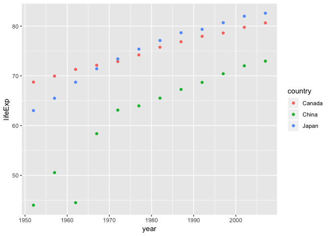

```r
suppressPackageStartupMessages(library(tidyverse))
suppressPackageStartupMessages(library(gapminder))
suppressPackageStartupMessages(library(reshape2))
```

## Data Reshaping Prompts
### Activty #2

Here I'd like to make a tilble for yearly life expectancy for China, Japan and Canada, with the spread() function:

```r
lifeExp_sub <- gapminder %>%
  select("lifeExp","country","year") %>% 
  filter(country == "China" | country == "Canada" | country == "Japan")
  
  # using the spread() function to list the lifeExp with one row per year in three countries
  spread(lifeExp_sub,key = "country", value = "lifeExp") %>% 
  rename(lifeExp_Canada = "Canada", lifeExp_China = "China", lifeExp_Japan = "Japan") %>% 
  # stylize and show the table 
  knitr::kable(format = "html", caption = "lifeExp in three countries")
```

<table>
<caption>lifeExp in three countries</caption>
 <thead>
  <tr>
   <th style="text-align:right;"> year </th>
   <th style="text-align:right;"> lifeExp_Canada </th>
   <th style="text-align:right;"> lifeExp_China </th>
   <th style="text-align:right;"> lifeExp_Japan </th>
  </tr>
 </thead>
<tbody>
  <tr>
   <td style="text-align:right;"> 1952 </td>
   <td style="text-align:right;"> 68.750 </td>
   <td style="text-align:right;"> 44.00000 </td>
   <td style="text-align:right;"> 63.030 </td>
  </tr>
  <tr>
   <td style="text-align:right;"> 1957 </td>
   <td style="text-align:right;"> 69.960 </td>
   <td style="text-align:right;"> 50.54896 </td>
   <td style="text-align:right;"> 65.500 </td>
  </tr>
  <tr>
   <td style="text-align:right;"> 1962 </td>
   <td style="text-align:right;"> 71.300 </td>
   <td style="text-align:right;"> 44.50136 </td>
   <td style="text-align:right;"> 68.730 </td>
  </tr>
  <tr>
   <td style="text-align:right;"> 1967 </td>
   <td style="text-align:right;"> 72.130 </td>
   <td style="text-align:right;"> 58.38112 </td>
   <td style="text-align:right;"> 71.430 </td>
  </tr>
  <tr>
   <td style="text-align:right;"> 1972 </td>
   <td style="text-align:right;"> 72.880 </td>
   <td style="text-align:right;"> 63.11888 </td>
   <td style="text-align:right;"> 73.420 </td>
  </tr>
  <tr>
   <td style="text-align:right;"> 1977 </td>
   <td style="text-align:right;"> 74.210 </td>
   <td style="text-align:right;"> 63.96736 </td>
   <td style="text-align:right;"> 75.380 </td>
  </tr>
  <tr>
   <td style="text-align:right;"> 1982 </td>
   <td style="text-align:right;"> 75.760 </td>
   <td style="text-align:right;"> 65.52500 </td>
   <td style="text-align:right;"> 77.110 </td>
  </tr>
  <tr>
   <td style="text-align:right;"> 1987 </td>
   <td style="text-align:right;"> 76.860 </td>
   <td style="text-align:right;"> 67.27400 </td>
   <td style="text-align:right;"> 78.670 </td>
  </tr>
  <tr>
   <td style="text-align:right;"> 1992 </td>
   <td style="text-align:right;"> 77.950 </td>
   <td style="text-align:right;"> 68.69000 </td>
   <td style="text-align:right;"> 79.360 </td>
  </tr>
  <tr>
   <td style="text-align:right;"> 1997 </td>
   <td style="text-align:right;"> 78.610 </td>
   <td style="text-align:right;"> 70.42600 </td>
   <td style="text-align:right;"> 80.690 </td>
  </tr>
  <tr>
   <td style="text-align:right;"> 2002 </td>
   <td style="text-align:right;"> 79.770 </td>
   <td style="text-align:right;"> 72.02800 </td>
   <td style="text-align:right;"> 82.000 </td>
  </tr>
  <tr>
   <td style="text-align:right;"> 2007 </td>
   <td style="text-align:right;"> 80.653 </td>
   <td style="text-align:right;"> 72.96100 </td>
   <td style="text-align:right;"> 82.603 </td>
  </tr>
</tbody>
</table>

And plot the table above to show the lifeExp change in one graph:

```r
  ggplot(lifeExp_sub, aes(year,lifeExp)) +
  geom_point(aes(colour=country))
```

<!-- -->

### Activty #5 Simple data manipulations in R
#### Group
First select the columns to form a table I want to work on:

```r
gdpPCap <- gapminder %>%
  select("gdpPercap","continent","country","year")
knitr::kable(head(gdpPCap,20))
```


 gdpPercap  continent   country        year
----------  ----------  ------------  -----
  779.4453  Asia        Afghanistan    1952
  820.8530  Asia        Afghanistan    1957
  853.1007  Asia        Afghanistan    1962
  836.1971  Asia        Afghanistan    1967
  739.9811  Asia        Afghanistan    1972
  786.1134  Asia        Afghanistan    1977
  978.0114  Asia        Afghanistan    1982
  852.3959  Asia        Afghanistan    1987
  649.3414  Asia        Afghanistan    1992
  635.3414  Asia        Afghanistan    1997
  726.7341  Asia        Afghanistan    2002
  974.5803  Asia        Afghanistan    2007
 1601.0561  Europe      Albania        1952
 1942.2842  Europe      Albania        1957
 2312.8890  Europe      Albania        1962
 2760.1969  Europe      Albania        1967
 3313.4222  Europe      Albania        1972
 3533.0039  Europe      Albania        1977
 3630.8807  Europe      Albania        1982
 3738.9327  Europe      Albania        1987

Then we can group it by year and continent, and take the mean of each year's gdpPercap:

```r
gdp_group <- gdpPCap %>% 
  group_by(year,continent) %>% 
  summarize(mean_gdpPercap=mean(gdpPercap),nCountries=n())
knitr::kable(head(gdp_group,20))
```


 year  continent    mean_gdpPercap   nCountries
-----  ----------  ---------------  -----------
 1952  Africa             1252.572           52
 1952  Americas           4079.063           25
 1952  Asia               5195.484           33
 1952  Europe             5661.057           30
 1952  Oceania           10298.086            2
 1957  Africa             1385.236           52
 1957  Americas           4616.044           25
 1957  Asia               5787.733           33
 1957  Europe             6963.013           30
 1957  Oceania           11598.522            2
 1962  Africa             1598.079           52
 1962  Americas           4901.542           25
 1962  Asia               5729.370           33
 1962  Europe             8365.487           30
 1962  Oceania           12696.452            2
 1967  Africa             2050.364           52
 1967  Americas           5668.253           25
 1967  Asia               5971.173           33
 1967  Europe            10143.824           30
 1967  Oceania           14495.022            2

#### SPLIT

```r
gdp_split <- gdp_group %>% 
 spread(key = "year", value="mean_gdpPercap")
knitr::kable(gdp_split)
```


continent    nCountries        1952        1957        1962        1967        1972        1977        1982        1987        1992        1997        2002        2007
----------  -----------  ----------  ----------  ----------  ----------  ----------  ----------  ----------  ----------  ----------  ----------  ----------  ----------
Africa               52    1252.572    1385.236    1598.079    2050.364    2339.616    2585.939    2481.593    2282.669    2281.810    2378.760    2599.385    3089.033
Americas             25    4079.063    4616.044    4901.542    5668.253    6491.334    7352.007    7506.737    7793.400    8044.934    8889.301    9287.677   11003.032
Asia                 33    5195.484    5787.733    5729.370    5971.173    8187.469    7791.314    7434.135    7608.227    8639.690    9834.093   10174.090   12473.027
Europe               30    5661.057    6963.013    8365.487   10143.824   12479.575   14283.979   15617.897   17214.311   17061.568   19076.782   21711.732   25054.482
Oceania               2   10298.086   11598.522   12696.452   14495.022   16417.333   17283.958   18554.710   20448.040   20894.046   24024.175   26938.778   29810.188

#### STACK
Or stack the table above, with a union column of continent and number of countries:

```r
gdp_stack <- gdp_split %>% 
  unite(continent_n, continent, nCountries) %>% 
  melt(id="continent_n") %>% 
  arrange(continent_n)
knitr::kable(head(gdp_stack,30))
```


continent_n   variable        value
------------  ---------  ----------
Africa_52     1952         1252.572
Africa_52     1957         1385.236
Africa_52     1962         1598.079
Africa_52     1967         2050.364
Africa_52     1972         2339.616
Africa_52     1977         2585.939
Africa_52     1982         2481.593
Africa_52     1987         2282.669
Africa_52     1992         2281.810
Africa_52     1997         2378.760
Africa_52     2002         2599.385
Africa_52     2007         3089.033
Americas_25   1952         4079.063
Americas_25   1957         4616.044
Americas_25   1962         4901.542
Americas_25   1967         5668.253
Americas_25   1972         6491.334
Americas_25   1977         7352.007
Americas_25   1982         7506.737
Americas_25   1987         7793.400
Americas_25   1992         8044.934
Americas_25   1997         8889.301
Americas_25   2002         9287.677
Americas_25   2007        11003.032
Asia_33       1952         5195.484
Asia_33       1957         5787.733
Asia_33       1962         5729.370
Asia_33       1967         5971.173
Asia_33       1972         8187.469
Asia_33       1977         7791.314

#### JOIN

```r
A<-data.frame(c1=c("C","a","n","a","d","a"), c2=1:6)
B <- data.frame(c1=c("C","h","i","n","a"), c3=c("o","p","q","r","s"))
C <- left_join(A, B)
```

```
## Joining, by = "c1"
```

```
## Warning: Column `c1` joining factors with different levels, coercing to
## character vector
```

```r
A
```

```
##   c1 c2
## 1  C  1
## 2  a  2
## 3  n  3
## 4  a  4
## 5  d  5
## 6  a  6
```

```r
B
```

```
##   c1 c3
## 1  C  o
## 2  h  p
## 3  i  q
## 4  n  r
## 5  a  s
```

```r
knitr::kable(C)
```


c1    c2  c3 
---  ---  ---
C      1  o  
a      2  s  
n      3  r  
a      4  s  
d      5  NA 
a      6  s  

#### SUBSET
Let's make a subset of 'gdp_group': filter the values in 2007.

```r
gdp_2007 <- gdp_group %>% 
  filter(year == 2007)
knitr::kable(gdp_2007)
```


 year  continent    mean_gdpPercap   nCountries
-----  ----------  ---------------  -----------
 2007  Africa             3089.033           52
 2007  Americas          11003.032           25
 2007  Asia              12473.027           33
 2007  Europe            25054.482           30
 2007  Oceania           29810.188            2

#### TRANSPOSE
And transpose the table above:

```r
gdp_2007_t <- data.frame(t(gdp_2007))
knitr::kable(gdp_2007_t)
```

                 X1         X2          X3          X4          X5        
---------------  ---------  ----------  ----------  ----------  ----------
year             2007       2007        2007        2007        2007      
continent        Africa     Americas    Asia        Europe      Oceania   
mean_gdpPercap   3089.033   11003.032   12473.027   25054.482   29810.188 
nCountries       52         25          33          30          2         

### SORT
Now sort the table "gdp_2007" by "nCountries"


```r
gdp_2007_s <- arrange(gdp_2007,nCountries)
knitr::kable(gdp_2007_s)
```


 year  continent    mean_gdpPercap   nCountries
-----  ----------  ---------------  -----------
 2007  Oceania           29810.188            2
 2007  Americas          11003.032           25
 2007  Europe            25054.482           30
 2007  Asia              12473.027           33
 2007  Africa             3089.033           52


## Join Prompts
### Activty #2 Cheatsheet for dplyr join functions

**Yuki Rang**

#### The data
One data frame is some kpop groups with their group name, number of members, company and representative song.
Another data frame comes from the release year of the songs.

```r
kpopGroups <- "
  group,      company, nMembers,repSong
  EXO,         SM,      9,       Growl
  BTS,         BigHit,  7,       Fake Love
  BigBang,      YG,      5,       Fantastic Baby
  GOT7,        JYP,     7,       Hard Carry
  NCT127,      SM,      10,      Boss
  Blackpink,   YG,      4,       Boombahya
  Twice,       JYP,     9,       Cheer Up
  Seventeen,   Pledis,  13,      Don't Wanna Cry
  Red Velvet,  SM,      5,       Red Flavor 
  Wanna One,   YMC,     11,      Energetic
"
kpopGroups <- read_csv(kpopGroups, skip = 1)

releaseYear <- "
  repSong, group, release
  Gee,       Girls's Generation,     2009
  Fantastic Baby, BigBang,  2012
  Growl,      EXO,    2013
  Heart Attack, AOA,  2015
  Hard Carry,  GOT7,   2016
  Boss,        NCT127,   2017
  Fake Love, BTS,     2018
"
releaseYear <- read_csv(releaseYear, skip = 1)
knitr::kable(kpopGroups)
```


group        company    nMembers  repSong         
-----------  --------  ---------  ----------------
EXO          SM                9  Growl           
BTS          BigHit            7  Fake Love       
BigBang      YG                5  Fantastic Baby  
GOT7         JYP               7  Hard Carry      
NCT127       SM               10  Boss            
Blackpink    YG                4  Boombahya       
Twice        JYP               9  Cheer Up        
Seventeen    Pledis           13  Don't Wanna Cry 
Red Velvet   SM                5  Red Flavor      
Wanna One    YMC              11  Energetic       

```r
knitr::kable(releaseYear)
```


repSong          group                 release
---------------  -------------------  --------
Gee              Girls's Generation       2009
Fantastic Baby   BigBang                  2012
Growl            EXO                      2013
Heart Attack     AOA                      2015
Hard Carry       GOT7                     2016
Boss             NCT127                   2017
Fake Love        BTS                      2018

#### inner_join(kpopGroups,releaseYear)

> 
return all rows from x where there are matching values in y, and all columns from x and y. If there are multiple matches between x and y, all combination of the matches are returned.


```r
inner_join(kpopGroups,releaseYear,by='group') %>% 
  knitr::kable()
```


group     company    nMembers  repSong.x        repSong.y         release
--------  --------  ---------  ---------------  ---------------  --------
EXO       SM                9  Growl            Growl                2013
BTS       BigHit            7  Fake Love        Fake Love            2018
BigBang   YG                5  Fantastic Baby   Fantastic Baby       2012
GOT7      JYP               7  Hard Carry       Hard Carry           2016
NCT127    SM               10  Boss             Boss                 2017

Now we only have five groups listed, because *Wanna One* and so on don't show in the "releaseYear" table and *AOA* and *Girls's Generation* don't show in the "kpopGroups" table. While inner_join() would replicate the repSong column.

#### semi_join(kpopGroups,releaseYear)
> 
return all rows from x where there are matching values in y, keeping just columns from x. A semi join differs from an inner join because an inner join will return one row of x for each matching row of y, where a semi join will never duplicate rows of x.


```r
semi_join(kpopGroups,releaseYear,by='group') %>% 
  knitr::kable()
```


group     company    nMembers  repSong        
--------  --------  ---------  ---------------
EXO       SM                9  Growl          
BTS       BigHit            7  Fake Love      
BigBang   YG                5  Fantastic Baby 
GOT7      JYP               7  Hard Carry     
NCT127    SM               10  Boss           

We still have five groups listed, while only the repSong from "kpopGroups" has been kept.

#### left_join(kpopGroups,releaseYear)
>
left_join(x, y): Return all rows from x, and all columns from x and y. If there are multiple matches between x and y, all combination of the matches are returned. This is a mutating join.


```r
left_join(kpopGroups,releaseYear, by="group") %>% 
  knitr::kable()
```


group        company    nMembers  repSong.x         repSong.y         release
-----------  --------  ---------  ----------------  ---------------  --------
EXO          SM                9  Growl             Growl                2013
BTS          BigHit            7  Fake Love         Fake Love            2018
BigBang      YG                5  Fantastic Baby    Fantastic Baby       2012
GOT7         JYP               7  Hard Carry        Hard Carry           2016
NCT127       SM               10  Boss              Boss                 2017
Blackpink    YG                4  Boombahya         NA                     NA
Twice        JYP               9  Cheer Up          NA                     NA
Seventeen    Pledis           13  Don't Wanna Cry   NA                     NA
Red Velvet   SM                5  Red Flavor        NA                     NA
Wanna One    YMC              11  Energetic         NA                     NA

This time, we take all records from "kpopGroups"", and take the records in "releaseYear" with same group as in "kpopGroups", and combine them together.

Similarly, the right_join()

>return all rows from y, and all columns from x and y. Rows in y with no match in x will have NA values in the new columns. If there are multiple matches between x and y, all combinations of the matches are returned.


```r
right_join(kpopGroups,releaseYear, by="group") %>% 
  knitr::kable()
```


group                company    nMembers  repSong.x        repSong.y         release
-------------------  --------  ---------  ---------------  ---------------  --------
Girls's Generation   NA               NA  NA               Gee                  2009
BigBang              YG                5  Fantastic Baby   Fantastic Baby       2012
EXO                  SM                9  Growl            Growl                2013
AOA                  NA               NA  NA               Heart Attack         2015
GOT7                 JYP               7  Hard Carry       Hard Carry           2016
NCT127               SM               10  Boss             Boss                 2017
BTS                  BigHit            7  Fake Love        Fake Love            2018


#### anti_join(kpopGroups,releaseYear)
>
anti_join(x, y): Return all rows from x where there are not matching values in y, keeping just columns from x. This is a filtering join.


```r
anti_join(kpopGroups,releaseYear,by="group") %>% 
  knitr::kable()
```


group        company    nMembers  repSong         
-----------  --------  ---------  ----------------
Blackpink    YG                4  Boombahya       
Twice        JYP               9  Cheer Up        
Seventeen    Pledis           13  Don't Wanna Cry 
Red Velvet   SM                5  Red Flavor      
Wanna One    YMC              11  Energetic       

We keep only five groups in "kpopGroups" that don't show in "releaseYear".

#### full_join(kpopGroups,releaseYear)

> full_join(x, y): Return all rows and all columns from both x and y. Where there are not matching values, returns NA for the one missing. This is a mutating join.


```r
full_join(kpopGroups,releaseYear,by="group") %>% 
  knitr::kable()
```


group                company    nMembers  repSong.x         repSong.y         release
-------------------  --------  ---------  ----------------  ---------------  --------
EXO                  SM                9  Growl             Growl                2013
BTS                  BigHit            7  Fake Love         Fake Love            2018
BigBang              YG                5  Fantastic Baby    Fantastic Baby       2012
GOT7                 JYP               7  Hard Carry        Hard Carry           2016
NCT127               SM               10  Boss              Boss                 2017
Blackpink            YG                4  Boombahya         NA                     NA
Twice                JYP               9  Cheer Up          NA                     NA
Seventeen            Pledis           13  Don't Wanna Cry   NA                     NA
Red Velvet           SM                5  Red Flavor        NA                     NA
Wanna One            YMC              11  Energetic         NA                     NA
Girls's Generation   NA               NA  NA                Gee                  2009
AOA                  NA               NA  NA                Heart Attack         2015

Now we have a full record of all the records from both groups.
